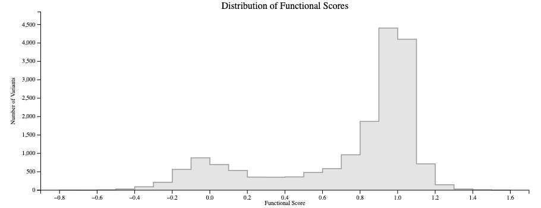
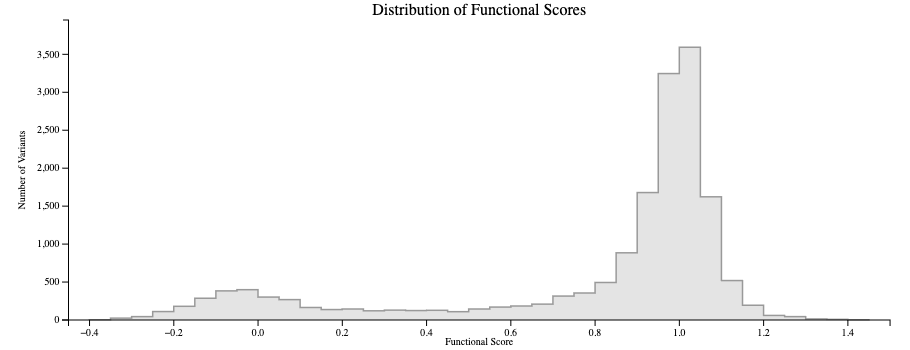
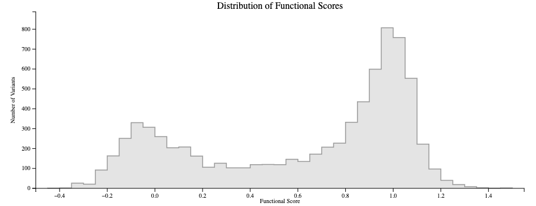

# Результаты исследования функционального эффекта миссенсов в LDLR с помощью ГМС

## Описание 

Daniel R Tabet, *et al*. The functional landscape of coding variation in the familial hypercholesterolemia gene *LDLR. Science*. 2025  
https://www.science.org/doi/10.1126/science.ady7186

Варианты в гене *LDLR*, вызывающем семейную гиперхолестеролемию, могут повышать концентрацию холестерина липопротеинов низкой плотности (ЛПНП) в крови и увеличивать риск преждевременного атеросклероза. Почти для половины клинически встречающихся миссенс-вариантов *LDLR* отсутствуют четкие классификации.

В работе применили мультиплексный анализ *in vitro*, измеряющий связывание и интернализацию частиц ЛПНП. Баркодированные кДНК-библиотеки, содержащие почти все возможные замены одной аминокислоты в LDLR, были введены в геномно интегрированную «посадочную площадку» Bxb1 в клетках HeLa, лишенных эндогенного LDLR. Клетки отбирались по поглощению ЛПНП с помощью флуоресцентной сортировки клеток. Функциональные веса масштабировались таким образом, что **значения 0 и 1 соответствуют медианному поведению нонсенс- и синонимичных вариантов**.

| Фенотип | Число вариантов | Имя колонки | Ссылка|
| --------|---------------:|--------------|--------------------|
| LDL uptake | 17,390 | Upt.Score | [mavedb:00001269-a-1](https://mavedb.org/score-sets/urn:mavedb:00001269-a-1) |
| LDLR cell-surface abundance | 16,796 | Abund.Score| [mavedb:00001269-b-1](https://mavedb.org/score-sets/urn:mavedb:00001269-b-1) |
| LDL uptake with VLDL | 7,586 | VLDL.Score | [mavedb:00001269-c-1](https://mavedb.org/score-sets/urn:mavedb:00001269-c-1) |

Примечания: 
- По ссылкам приводится наглядная интерактивная тепловая карта всех описанных замен
- При этом сайт maveDB капризный, требует квн и не всегда нормально грузится
- В таблице приведены веса всех вариантов, в т.ч. нонсенсов и синонимичных
    
## Формат таблицы

| Имя колонки | Содержимое | Пример |
| --------|--------------|--------------------|
| #AAPos | Позиция в белке | 2 |
| HGVSp | Вариант | Pro3Gln, Ser849*, Ile821= |
| Upt.Score | LDL Uptake, вес (Score) | 0.11489326 |
| Upt.SE | LDL Uptake, ошибка (SE) | 0.261602384|
| Abund.Score | LDLR cell-surface abundance, вес (Score) | --"-- |
| Abund.SE | LDLR cell-surface abundance, ошибка (SE) | --"-- |
| VLDL.Score | LDL uptake with VLDL, вес (Score) | --"-- |
| VLDL.SE | LDL uptake with VLDL , ошибка (SE) | --"-- |

## Распределения весов

## LDL Uptake

## LDLR cell-surface abundance

## LDL uptake with VLDL

